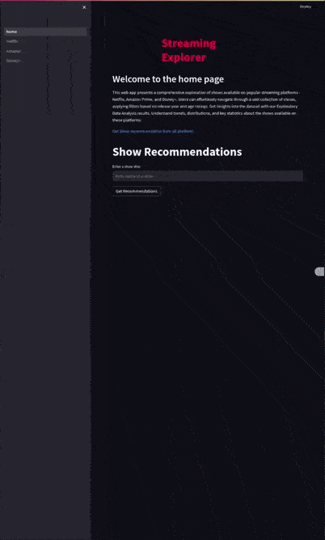

# Streaming Explorer



## Datasets Used

1. [Netflix Movies and TV Shows](https://www.kaggle.com/shivamb/netflix-shows)
2. [Amazon Prime Movies and TV Shows](https://www.kaggle.com/datasets/shivamb/amazon-prime-movies-and-tv-shows)
3. [Disney+ Movies and TV Shows](https://www.kaggle.com/datasets/shivamb/disney-movies-and-tv-shows)

## Requirements

requirements.yml file contains the necessary packages to run the code in this repository. To install the packages, run the following command:

```
conda env create -f environment.yaml
```

requirements.yml is generated using the following command:

```
conda env export --no-builds | grep -v "prefix" > environment.yaml
```

#### OR

You can use requirements.txt file to install all the dependencies.

```
pip install -r requirements.txt
```

## Pre-Commit hooks for developer

Install pre-commit for static code checking of all files before a new commit.

```
pip install pre-commit
```

To initiate pre-commit hooks to any git repistory do..

```
pre-commit install
```

Now pre-commit will run automatically on every git commit and commit will only happens when all the check are passed. Check .per-commit-config.yaml file to see more on the type of all static code check for furthure details.

## Backend server

To start the FastAPI server, you typically use the `uvicorn` command, which is a lightweight ASGI server. Here are the steps to start the FastAPI server:

1. Open a terminal or command prompt.

2. Navigate to the directory where your FastAPI application (`main.py` in this case) is located.

3. Run the following command:

   ```bash
   uvicorn src/backend/app:app --reload
   # or directly
   python src/backend/app.py
   # or using make
   make backend
   ```

   - `main` refers to the name of your Python file (`main.py`).
   - `app` is the name of the FastAPI instance in your file.
   - `--reload` enables auto-reloading, so the server restarts whenever there are changes in your code.

4. After running the command, you should see output indicating that the server is running.

5. By default, FastAPI will start the server on `http://127.0.0.1:8000`.

6. Open your web browser and navigate to [http://127.0.0.1:8000/docs](http://127.0.0.1:8000/docs) to access the Swagger documentation for your API.

The `--reload` option is useful during development but can be omitted in a production environment.

Make sure to keep the terminal open as long as you want the server to run. If you make changes to your code, the server will automatically reload to apply the changes.

To stop the server, press `Ctrl + C` in the terminal where the server is running.

## Frontend server

To start the streamlit app on your local browser

```bash
streamlit run src/frontend/home.py
# or using make
make frontend
```

## Initializing the database

To initialize the database, we first need to preprocess the raw dataset downloaded from kaggel. First, open the preprocessed.ipynb jupyter notebook. Follow the notebook to initialize the database.

- Run the data cleaning code to remove NaN values.
- Save the cleaned data inside a processed folder
- Load the cleaned data into your mysql database.

Remember to Download the datasets from kaggel and create a directory named `Data` and save the dataset inside the folder.

## Run Docker for backend and frontend

Build the docker image

```
docker build -t <image name> -f ./src/backend/Dockerfile .
```

Run the docker image. Here, we bind the host and docker containers port using host mode.

```
docker run --network=host --env-file .env <image name>`
```

## RUN docker compose

docker compose will build both the docker file and run them togather.

```
docker-compose up
```
